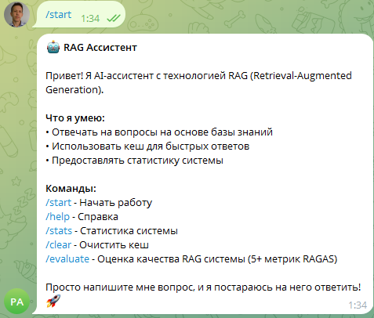
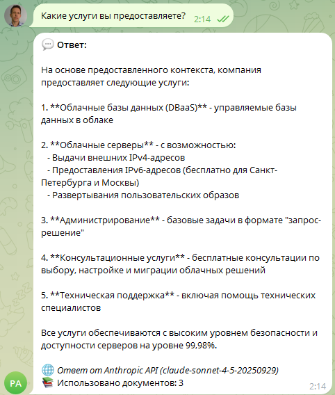
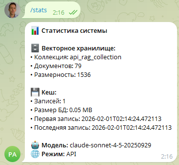
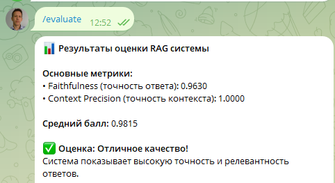
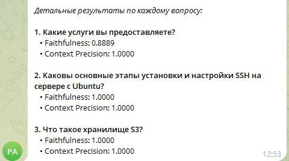

# 🤖 RAG Telegram Assistant

Интеллектуальный Telegram-бот с технологией RAG (Retrieval-Augmented Generation) для ответов на вопросы на основе базы знаний.


## 📋 Содержание

- [Описание](#-описание)
- [Возможности](#-возможности)
- [Технологии](#-технологии)
- [Установка](#-установка)
- [Настройка](#-настройка)
- [Использование](#-использование)
- [Структура проекта](#-структура-проекта)
- [Команды бота](#-команды-бота)
- [Метрики оценки](#-метрики-оценки)
- [Скриншоты](#-скриншоты)
- [Разработка](#-разработка)
- [Лицензия](#-лицензия)

## 🎯 Описание

RAG Telegram Assistant — это интеллектуальный бот, который использует технологию RAG для ответов на вопросы пользователей на основе предоставленной базы знаний. Бот объединяет:

- **Векторный поиск** (FAISS) для быстрого нахождения релевантной информации
- **LLM модель** (Claude Sonnet 4.5) для генерации точных ответов
- **Кеширование** для оптимизации производительности
- **Оценку качества** через RAGAS метрики

### Как это работает?

1. Пользователь задает вопрос в Telegram
2. Система проверяет кеш на наличие готового ответа
3. Если ответа нет, выполняется векторный поиск по базе знаний
4. Найденный контекст передается в LLM для генерации ответа
5. Ответ сохраняется в кеш и отправляется пользователю

## ✨ Возможности

- 💬 **Интеллектуальные ответы** на основе базы знаний
- 🔍 **Векторный поиск** с использованием FAISS
- 💾 **Кеширование ответов** для быстрого доступа
- 📊 **Статистика системы** в реальном времени
- 🎯 **Оценка качества** через RAGAS метрики
- 🚀 **Telegram интерфейс** для удобного взаимодействия
- 📚 **Поддержка больших документов** с умным chunking

## 🛠 Технологии

### Основные библиотеки

- **python-telegram-bot** (21.0+) - Telegram Bot API
- **anthropic** (0.34.0+) - Claude API через ProxyAPI
- **openai** (1.3.0+) - OpenAI API для embeddings
- **faiss-cpu** (1.7.4+) - Векторный поиск
- **ragas** (0.2.0+) - Оценка качества RAG систем

### Модели

- **LLM**: Claude Sonnet 4.5 (через ProxyAPI)
- **Embeddings**: text-embedding-3-small (OpenAI)
- **Vector DB**: FAISS (IndexFlatIP для cosine similarity)

## 📦 Установка

### Требования

- Python 3.11+
- pip
- Git

### Шаги установки

1. **Клонируйте репозиторий:**
```bash
git clone https://github.com/yourusername/rag-telegram-assistant.git
cd rag-telegram-assistant
```

2. **Создайте виртуальное окружение:**
```bash
python -m venv venv
```

3. **Активируйте виртуальное окружение:**
   - Windows (PowerShell):
     ```powershell
     .\venv\Scripts\Activate.ps1
     ```
   - Windows (CMD):
     ```cmd
     venv\Scripts\activate.bat
     ```
   - Linux/Mac:
     ```bash
     source venv/bin/activate
     ```

4. **Установите зависимости:**
```bash
pip install -r requirements.txt
```

## ⚙️ Настройка

### 1. Получите API ключи

#### Telegram Bot Token
1. Откройте [@BotFather](https://t.me/BotFather) в Telegram
2. Отправьте команду `/newbot`
3. Следуйте инструкциям для создания бота
4. Сохраните полученный токен

#### Anthropic API Key (ProxyAPI)
1. Зарегистрируйтесь на [ProxyAPI](https://proxyapi.ru)
2. Получите API ключ для Anthropic
3. Сохраните ключ

#### OpenAI API Key
1. Зарегистрируйтесь на [OpenAI](https://platform.openai.com)
2. Создайте API ключ
3. Сохраните ключ

### 2. Создайте файл `.env`

Создайте файл `.env` в корне проекта со следующим содержимым:

```env
# Telegram Bot
TELEGRAM_BOT_TOKEN=your-telegram-bot-token-here

# Anthropic API (ProxyAPI)
ANTHROPIC_API_KEY=your-anthropic-api-key-here

# OpenAI API (для embeddings)
OPENAI_API_KEY=your-openai-api-key-here
```

### 3. Подготовьте базу знаний

Поместите ваши документы в папку `data/`. Поддерживаются текстовые файлы (`.txt`).

**Пример структуры:**
```
data/
  ├── FAQ.txt           # Часто задаваемые вопросы
  ├── Инструкции.txt    # Инструкции
  └── Описание услуг.txt # Описание услуг
```

> **Примечание:** Вы можете объединить все документы в один файл `docs.txt` или использовать несколько файлов. Система автоматически загрузит все документы при первом запуске.

## 🚀 Использование

### Запуск бота

1. Убедитесь, что виртуальное окружение активировано
2. Убедитесь, что файл `.env` создан и заполнен
3. Запустите бота:

```bash
python app.py
```

Вы должны увидеть:
```
✅ Бот запущен и готов к работе!
Нажмите Ctrl+C для остановки
```

### Первое использование

1. Найдите вашего бота в Telegram (по имени, которое вы указали при создании)
2. Отправьте команду `/start`
3. Начните задавать вопросы!

## 📁 Структура проекта

```
rag-telegram-assistant/
├── app.py                 # Telegram бот (главный файл)
├── rag_pipeline.py        # RAG pipeline (основная логика)
├── vector_store.py        # Векторное хранилище (FAISS)
├── cache.py              # Кеширование ответов
├── evaluate_ragas.py     # Оценка качества через RAGAS
├── requirements.txt       # Зависимости проекта
├── .env                  # Переменные окружения (не в git)
├── README.md             # Документация
│
├── data/                 # База знаний
│   ├── FAQ.txt
│   ├── Инструкции.txt
│   └── Описание услуг.txt
│
├── faiss_db/             # Векторная база данных (FAISS)
│   ├── *.index
│   └── *.pkl
│
└── *.db                  # Базы данных кеша (SQLite)
```

## 🤖 Команды бота

### `/start`
Приветствие и информация о боте. Показывает список доступных команд.

### `/help`
Подробная справка по использованию бота и всех доступных команд.

### `/stats`
Показывает статистику системы:
- Количество документов в векторном хранилище
- Размер и количество записей в кеше
- Информация о модели и режиме работы

### `/clear`
Очищает кеш ответов. Полезно при обновлении базы знаний.

### `/evaluate`
Запускает оценку качества RAG системы через RAGAS. Выполняет:
- Подготовку тестового датасета
- Оценку по метрикам RAGAS (Faithfulness, Context Precision)
- Вывод детальных результатов

**Время выполнения:** 1-2 минуты

### Текстовые сообщения
Любой текст, отправленный боту (кроме команд), обрабатывается как вопрос. Бот найдет релевантную информацию и сгенерирует ответ.

## 📊 Метрики оценки

Команда `/evaluate` использует следующие метрики RAGAS:

### Основные метрики

1. **Faithfulness** (Точность ответа)
   - Оценивает соответствие ответа предоставленному контексту
   - Диапазон: 0.0 - 1.0 (1.0 = полное соответствие контексту)

2. **Context Precision** (Точность контекста)
   - Оценивает качество извлеченного контекста для ответа на вопрос
   - Диапазон: 0.0 - 1.0 (1.0 = идеальный контекст)

### Интерпретация результатов

- **≥ 0.7** - Отличное качество ✅
- **0.5 - 0.7** - Удовлетворительное качество ⚠️
- **< 0.5** - Требует улучшения ❌

## 📸 Скриншоты

### Главный экран бота



*Команда /start показывает приветствие и список команд*

### Пример диалога



*Бот отвечает на вопросы на основе базы знаний*

### Статистика системы



*Команда /stats показывает детальную статистику*

### Оценка качества



*Команда /evaluate показывает результаты оценки по всем метрикам*

### Детальные результаты



*Детальные результаты оценки по каждому вопросу*

## 🔧 Разработка

### Архитектура

Проект состоит из следующих модулей:

#### `app.py`
Telegram бот с обработчиками команд и сообщений. Использует `python-telegram-bot` для взаимодействия с Telegram API.

#### `rag_pipeline.py`
Основной pipeline RAG системы:
- Проверка кеша
- Векторный поиск
- Формирование промпта
- Генерация ответа через LLM
- Сохранение в кеш

#### `vector_store.py`
Векторное хранилище на основе FAISS:
- Загрузка и chunking документов
- Создание embeddings через OpenAI
- Поиск по векторам (cosine similarity)
- Сохранение индекса на диск

#### `cache.py`
Кеширование ответов в SQLite:
- Хранение пар вопрос-ответ
- Быстрый поиск по хешу запроса
- Статистика использования

#### `evaluate_ragas.py`
Оценка качества системы через RAGAS:
- Подготовка тестового датасета
- Запуск метрик оценки
- Вывод результатов

### Добавление новых документов

1. Поместите текстовые файлы в папку `data/`
2. Удалите файлы индекса FAISS (если нужно переиндексировать):
   ```bash
   rm -rf faiss_db/*.index faiss_db/*.pkl
   ```
3. Перезапустите бота - документы загрузятся автоматически

### Настройка параметров

Вы можете изменить параметры в `app.py`:

```python
pipeline = RAGPipeline(
    collection_name="api_rag_collection",  # Имя коллекции
    cache_db_path="api_rag_cache.db",      # Путь к кешу
    data_path="data",                     # Папка с .txt файлами (загружаются все .txt файлы)
    model="claude-sonnet-4-5-20250929"    # Модель LLM
)
```

### Изменение модели LLM

В файле `rag_pipeline.py` измените параметр `model`:

```python
model: str = "claude-sonnet-4-5-20250929"  # Текущая модель
# Или используйте другую модель Claude
```

### Изменение модели embeddings

В файле `vector_store.py` измените модель:

```python
model="text-embedding-3-small"  # Текущая модель
# Или используйте text-embedding-3-large для большей точности
```

## 🐛 Решение проблем

### Бот не запускается

**Проблема:** `TELEGRAM_BOT_TOKEN не установлен`
- **Решение:** Проверьте наличие файла `.env` и правильность токена

**Проблема:** `ANTHROPIC_API_KEY не установлен`
- **Решение:** Добавьте ключ ProxyAPI в `.env`

**Проблема:** `ModuleNotFoundError: No module named 'faiss'`
- **Решение:** Установите зависимости: `pip install -r requirements.txt`

### Ошибки при оценке

**Проблема:** Метрики не вычисляются (NaN)
- **Решение:** Проверьте наличие OpenAI API ключа для embeddings

**Проблема:** Оценка занимает слишком много времени
- **Решение:** Это нормально, оценка может занять 1-2 минуты

### Проблемы с кодировкой (Windows)

Если видите ошибки с кодировкой, убедитесь, что используете UTF-8:
```powershell
$env:PYTHONIOENCODING='utf-8'
python app.py
```

## 📝 Лицензия

Этот проект распространяется под лицензией MIT. См. файл `LICENSE` для подробностей.

## 👥 Авторы

- **Ваше имя** - [@yourusername](https://github.com/yourusername)

## 🙏 Благодарности

- [RAGAS](https://github.com/explodinggradients/ragas) - за отличную библиотеку оценки RAG систем
- [python-telegram-bot](https://github.com/python-telegram-bot/python-telegram-bot) - за удобный API для Telegram ботов
- [FAISS](https://github.com/facebookresearch/faiss) - за быстрый векторный поиск
- [Anthropic](https://www.anthropic.com) - за Claude модели
- [OpenAI](https://openai.com) - за embeddings модели

## 📞 Контакты

Если у вас есть вопросы или предложения:
- Создайте [Issue](https://github.com/yourusername/rag-telegram-assistant/issues)
- Напишите [Pull Request](https://github.com/yourusername/rag-telegram-assistant/pulls)

## 📈 Примеры использования

### Пример 1: Простой вопрос

**Пользователь:** Что такое машинное обучение?

**Бот:** Машинное обучение - это раздел искусственного интеллекта, который позволяет компьютерам обучаться на данных без явного программирования...

### Пример 2: Сложный вопрос

**Пользователь:** Какие основные типы машинного обучения существуют?

**Бот:** Основные типы машинного обучения включают:
1. Обучение с учителем...
2. Обучение без учителя...
3. Обучение с подкреплением...

## 🔒 Безопасность

⚠️ **Важно:**
- Никогда не коммитьте файл `.env` в репозиторий
- Храните API ключи в безопасности
- Используйте переменные окружения для продакшена
- Регулярно обновляйте зависимости

## 🚧 Roadmap

- [ ] Поддержка мультимодальных документов (изображения, PDF)
- [ ] Веб-интерфейс для управления базой знаний
- [ ] Интеграция с другими мессенджерами
- [ ] Экспорт истории диалогов
- [ ] Аналитика использования бота

## 🤝 Вклад в проект

Мы приветствуем вклад в проект! Пожалуйста:

1. Fork проекта
2. Создайте ветку для новой функции (`git checkout -b feature/AmazingFeature`)
3. Commit изменения (`git commit -m 'Add some AmazingFeature'`)
4. Push в ветку (`git push origin feature/AmazingFeature`)
5. Откройте Pull Request

## 📝 Changelog

### v1.0.0 (2026-02-01)
- ✨ Первый релиз
- 🤖 Telegram бот интерфейс
- 🔍 Векторный поиск через FAISS
- 📊 Оценка качества через RAGAS
- 💾 Кеширование ответов

## 🔗 Полезные ссылки

- [Документация RAGAS](https://docs.ragas.io/)
- [Документация python-telegram-bot](https://python-telegram-bot.readthedocs.io/)
- [Документация FAISS](https://github.com/facebookresearch/faiss/wiki)
- [ProxyAPI Документация](https://proxyapi.ru/docs)
- [Anthropic Claude API](https://docs.anthropic.com/)

## ⭐ Звезды

Если проект был полезен, поставьте звезду на GitHub! Это мотивирует продолжать разработку.

---

**Сделано с ❤️ используя RAG технологию**

